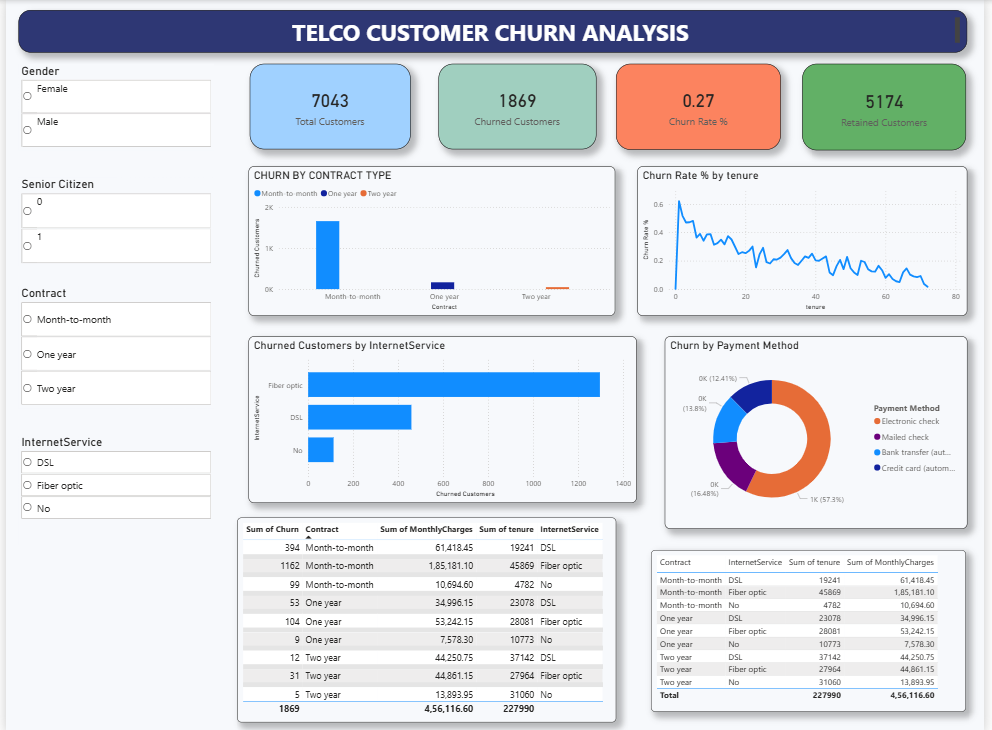

# Telco Customer Churn Analysis (Power BI)

This project focuses on analyzing customer churn data for a telecom company using Power BI. The objective of this analysis is to understand customer behavior, identify churn patterns, and highlight key factors that influence customer retention.

The project covers data cleaning, transformation, DAX calculations, and the development of an interactive dashboard that allows users to explore churn insights across different customer segments.

## Project Objective
- Understand why customers are leaving the telecom service
- Identify high-churn customer segments
- Analyze the impact of contract type, tenure, internet service, and payment methods
- Build a clear and interactive dashboard for business decision-making

## Dataset Overview
The dataset contains customer-level information including:
- Demographic details (gender, senior citizen)
- Contract and account information (contract type, tenure, monthly charges)
- Services used (internet service, phone service, add-ons)
- Payment methods
- Churn status of customers

## Data Cleaning & Preparation
Before creating the dashboard, the following data cleaning steps were performed:
- Converted the churn column into numeric values (0 = retained, 1 = churned)
- Removed blank and inconsistent values
- Fixed incorrect data types for numerical and categorical fields
- Standardized column names for better readability
- Verified totals and relationships to avoid reporting errors
- Created calculated measures using DAX for accurate KPIs

## Key Metrics Created
- Total Customers
- Churned Customers
- Retained Customers
- Churn Rate (%)

## Key Insights
- Customers with month-to-month contracts have the highest churn
- Churn rate decreases as customer tenure increases
- Fiber optic internet users show higher churn compared to DSL users
- Electronic check is the most common payment method among churned customers
- Long-term contracts (one year and two years) show significantly lower churn

## Dashboard Features
- KPI cards showing total customers, churned customers, retained customers, and churn rate
- Interactive slicers for gender, senior citizen, contract type, and internet service
- Churn analysis by contract type
- Churn trend analysis by customer tenure
- Churn distribution by internet service and payment method
- Summary tables showing churn impact on tenure and monthly charges

## Tools & Technologies Used
- Power BI
- DAX
- Power Query
- Data Cleaning & Data Visualization

## Dashboard Preview

## Conclusion
This project helped me strengthen my Power BI skills, especially in data cleaning, DAX calculations, and dashboard design. The insights from this analysis can help telecom companies take data-driven actions to reduce churn and improve customer retention.

