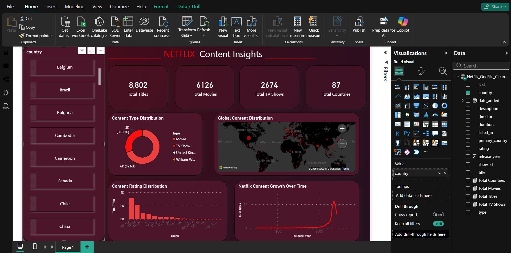

# Netflix Content Insights – Power BI Dashboard

## 📌 Project Overview
This project is an interactive Power BI dashboard built to analyze Netflix’s content library, focusing on movies and TV shows across different countries, ratings, and release years.  
The goal was to transform raw data into meaningful insights using data cleaning, DAX measures, and effective visual storytelling.

---

## 🛠 Tools & Technologies
- Power BI
- DAX
- CSV / Excel
- Data Cleaning & Transformation

---

## 📊 Key Metrics
- Total Titles
- Total Movies
- Total TV Shows
- Total Countries

---

## 🔍 Key Insights
- Movies make up a larger share of Netflix’s catalog compared to TV shows
- Significant growth in content releases after 2015
- United States, India, and United Kingdom contribute the most content
- TV-MA and TV-14 are the most common content ratings

---

## 📁 Project Files
- `Netflix_Dashboard.pbix` – Power BI dashboard file
- `Netflix_OneFile_Cleaned_Final.csv` – cleaned and transformed dataset
- `dashboard_preview.png` – dashboard snapshot for quick viewing

---

## 🧠 What I Worked On
- Cleaned and standardized raw Netflix data
- Handled missing and inconsistent values
- Created DAX measures for KPI cards
- Designed an interactive dashboard with slicers and maps
- Focused on clarity, usability, and insights

---

## 📷 Dashboard Preview

